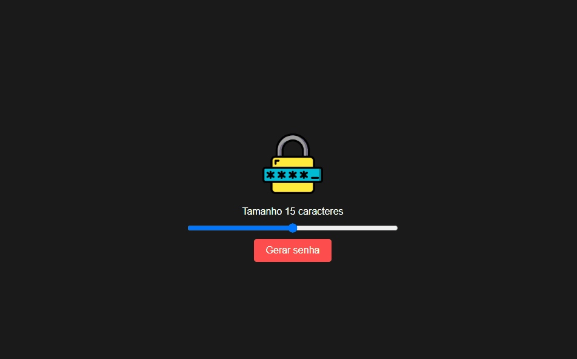

# Gerador de Senha

  

## Descrição
Um simples gerador de senhas que permite personalizar o tamanho da senha e copiá-la para a área de transferência.

## Tecnologias
- HTML
- CSS
- JavaScript

## Como usar
1. Abra o arquivo `index.html` em seu navegador.
2. Mova o controle deslizante para escolher o tamanho da senha desejado.
3. Clique no botão "Gerar senha" para gerar uma nova senha.
4. Clique na senha gerada para copiá-la para a área de transferência.
5. Uma mensagem indicando que a senha foi copiada com sucesso será exibida temporariamente.

